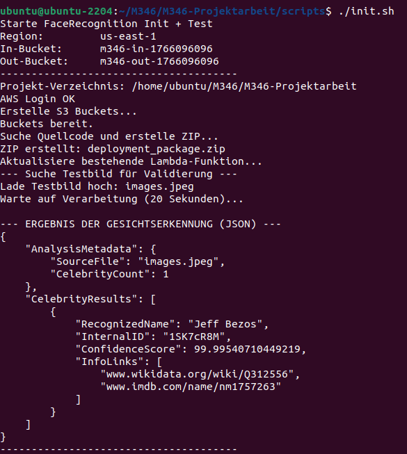
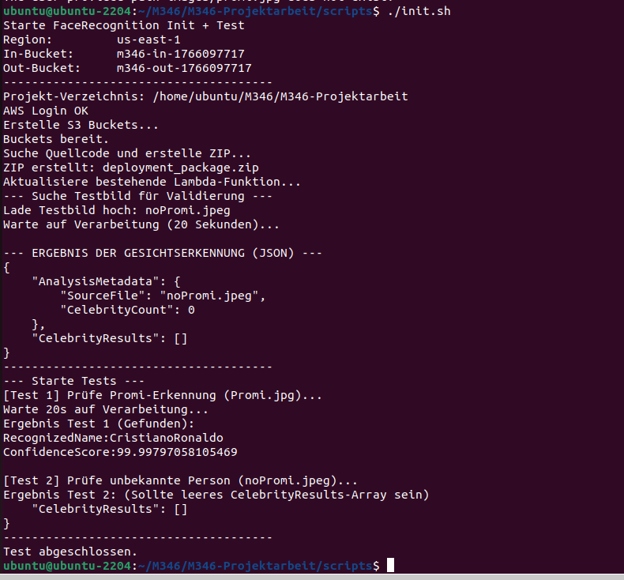

# Unser Testbericht

**Wer hat getestet:** Gabriel Sarkis, Alessandro Renzetti, Lionel Davatz

**Datum:** 19.12.2025  

In diesem Bericht zeigen wir, dass unsere Gesichtserkennung in der AWS Cloud funktioniert.

---

## 1. Was haben wir getestet?

| Nr. | Testfall | Ziel | Status |
|:--- |:--- |:--- |:--- |
| 1 | Star erkennen | Erkennt das System Jeff Bezos? | ✅ OK |
| 2 | Normale Person | Erkennt das System, dass kein Star da ist? | ✅ OK |
| 3 | Automatik | Läuft das ganze Script von alleine durch? | ✅ OK |

---

## 2. Die Ergebnisse

### Test 1: Der Star-Test (Jeff Bezos)
Wir haben ein Bild von Jeff Bezos hochgeladen, um zu sehen, ob der AWS-Dienst ihn findet.

* **Was ist passiert:** Das Script hat alles vorbereitet und das Bild hochgeladen.
* **Ergebnis:** Wie man im Screenshot sieht, wurde Jeff Bezos sofort erkannt. Die Sicherheit liegt bei fast 100%.

**Fazit:** Der Test war erfolgreich. Die Verbindung zwischen unserem Script, Lambda und AWS Rekognition klappt.

---

### Test 2: Der "keinPromi"-Test (noPromi.jpeg)
Wir haben auch ein Bild ohne Star getestet, damit das System keine falschen Namen erfindet.

* **Ergebnis:** Das System zeigt "CelebrityCount: 0" an. Das ist genau richtig.

**Fazit:** Das System erkennt den Unterschied zwischen Promis und normalen Personen korrekt.

---

## 3. Unser Schlusswort
Alles läuft vollautomatisch über unser `init.sh` Script. Man muss nichts von Hand machen und sieht das Ergebnis sofort im Terminal.